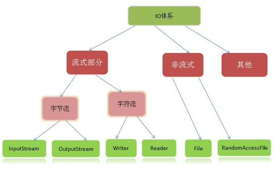
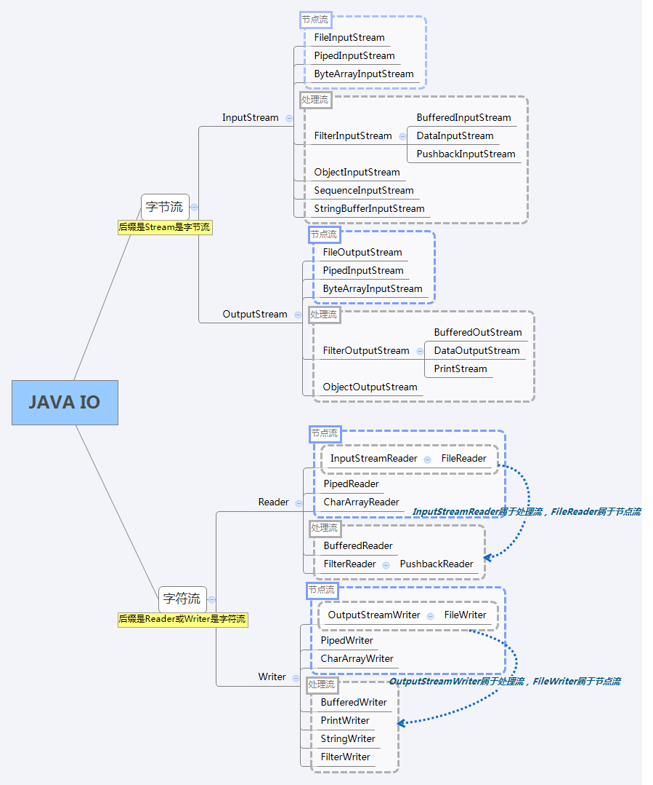

## 概览

[TOC]

## Java中IO流的体系结构

**节点流**：程序直接连接到实际的数据源，进行读写。

**处理流**：又称高级流或包装流，处理流对一个已存在的流进行连接，通过封装后的流来进行读写。

## 1. 字节流

**InputStream中的三个基本的读方法**
`abstract int read() `：读取一个字节数据，并返回读到的数据，如果返回-1，表示读到了输入流的末尾。
`int read(byte[] b) `：将数据读入一个字节数组，同时返回实际读取的字节数。如果返回-1，表示读到了输入流的末尾。
`int read(byte[] b, int off, int len) `：将数据读入一个字节数组，同时返回实际读取的字节数。如果返回-1，表示读到了输入流的末尾。off指定在数组b中存放数据的起始偏移位置；len指定读取的最大字节数。

流结束的判断：方法read()的返回值为-1时；readLine()的返回值为null时。

**outputStream中的三个基本的写方法**
`abstract void write(int b)`：往输出流中写入一个字节。
`void write(byte[] b) `：往输出流中写入数组b中的所有字节。
`void write(byte[] b, int off, int len)` ：往输出流中写入数组b中从偏移量off开始的len个字节的数据。

其它方法
`void flush()` ：刷新输出流，强制缓冲区中的输出字节被写出。
`void close()` ：关闭输出流，释放和这个流相关的系统资源。

## 2. 字符流

**字符流的由来：** Java中字符是采用Unicode标准，一个字符是16位，即一个字符使用两个字节来表示。为此，JAVA中引入了处理字符的流。因为数据编码的不同，而有了对字符进行高效操作的流对象。本质其实就是基于字节流读取时，去查了指定的码表。

**字符输入流Reader主要方法**

`int read()`： 读取一个字符，返回值为读取的字符
`int read(char cbuf[])`： 读取一系列字符到数组cbuf[]中，返回值为实际读取的字符的数量
`abstract int read(char cbuf[],int off,int len)`： 读取len个字符，从数组cbuf[]的下标off处开始存放，返回值为实际读取的字符数量，该方法必须由子类实现

**字符输出流Writer主要方法**

`void write(int c)`：将整型值c的低16位写入输出流 
`void write(char cbuf[])`：将字符数组cbuf[]写入输出流 
`abstract void write(char cbuf[],int off,int len)`：将字符数组cbuf[]中的从索引为off的位置处开始的len个字符写入输出流 
`void write(String str)`：将字符串str中的字符写入输出流 
`void write(String str,int off,int len)`：将字符串str 中从索引off开始处的len个字符写入输出流 

## 字节流和字符流的区别

字节流没有缓冲区，是直接输出的，而字符流是输出到缓冲区的。因此在输出时，字节流不调用colse()方法时，信息已经输出了，而字符流只有在调用close()方法关闭缓冲区时，信息才输出。要想字符流在未关闭时输出信息，则需要手动调用flush()方法。

读写单位不同：字节流以字节（8bit）为单位，字符流以字符为单位，根据码表映射字符，一次可能读多个字节。

处理对象不同：字节流能处理所有类型的数据（如图片、avi等），而字符流只能处理字符类型的数据。

**结论**：只要是处理纯文本数据，就优先考虑使用字符流。除此之外都使用字节流。