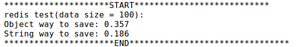
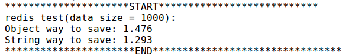
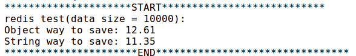
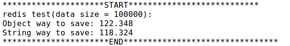

## 测试代码
```java
...
    @Test
    public void redisTest() {
        int size = 100;
        List<String> hobby = new ArrayList<>();
        hobby.add("swimming");
        hobby.add("sing");
        hobby.add("draw");
        hobby.add("football");
        TestClass t = new TestClass("Bob","Rocket",20,hobby);
        redisTemplate.setDefaultSerializer(new StringRedisSerializer());
        System.out.println("redis test(data size = " + size +"):");
        long startTime = 0l;
        startTime = System.currentTimeMillis();
        for(int i=0;i<size;i++){
            redisTemplate.opsForValue().set("Test:TestClass", t,3, TimeUnit.DAYS);
        }
        System.out.println("Object way to save: " + (double) (System.currentTimeMillis() - startTime) / 1000);
        startTime = System.currentTimeMillis();
        for(int i=0;i<size;i++){
            stringRedisTemplate.opsForValue().set("Test:TestClass", JSON.toJSONString(t),3, TimeUnit.DAYS);
        }
        System.out.println("String way to save: " + (double) (System.currentTimeMillis() - startTime) / 1000);
    }
...
```

## 测试数据

1. 数据量为100时




2. 数据量为1000时

   

3. 数据量为10000时

   

4. 数据量为100000时

   

## 分析

Object存取时需要将对象进行序列化处理，而通过阿里的JSON工具将Object转String这一过程要比Object序列化这一过程要快。所以整体的存取效率stringRedisTemplate高于redisTemplate。

