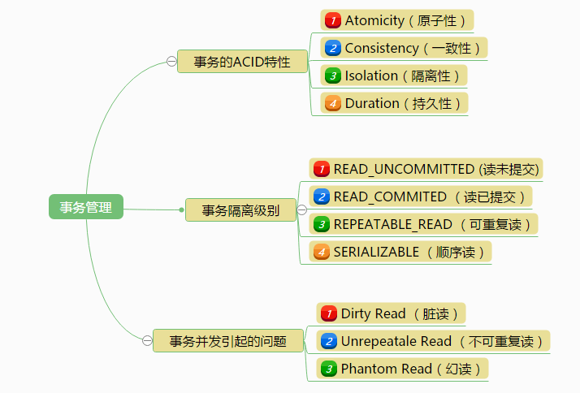

# 数据库笔记

## 1. 视图
* 理解： 一个虚拟的表，将一些经常会用到的数据项，单独抽出来创建一个视图，以后直接将视图当作表来查询即可。

## 2. 事务

* ### 概述
事务（Transaction）是由一系列对系统中数据进行访问与更新的操作所组成的一个程序执行逻辑单元。

* ### 1. ACID
事务具有4个基本特征，分别是：原子性（Atomicity）、一致性（Consistency）、隔离性（Isolation）、持久性（Duration），简称ACID。

* ### 2. 隔离级别
ACID这4个特征中，最难理解的是隔离性。在标准SQL规范中，定义了4个事务隔离级别，不同的隔离级别对事务的处理不同。4个隔离级别分别是：读未提及（READ_UNCOMMITTED）、读已提交（READ_COMMITTED）、可重复读（REPEATABLE_READ）、顺序读（SERIALIZABLE）。

* ### 3. 事务并发引起的问题
数据库在不同的隔离性级别下并发访问可能会出现以下几种问题：脏读（Dirty Read）、不可重复读（Unrepeatable Read）、幻读（Phantom Read）。

* ### 4. 事务隔离级别对比
| 事务隔离级别	| 脏读	| 不可重复读 | 幻读 |
| :-: |  :-: | :-: | :-: |
|读未提及（READ_UNCOMMITTED）|	允许|	允许|	允许|
|读已提交（READ_COMMITTED）|	禁止|	允许|	允许|
|可重复读（REPEATABLE_READ）|	禁止|	禁止|	允许|
|顺序读（SERIALIZABLE）	|禁止|	禁止|	禁止|
>4种事务隔离级别从上往下，级别越高，并发性越差，安全性就越来越高。
一般数据默认级别是读以提交或可重复读。
