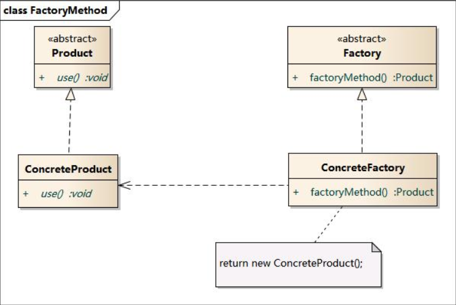

## 概览

[TOC]

### 1. 简单工厂模式

简单工厂模式的要点在于：当你需要什么，只需要传入一个正确的参数，就可以获取你所需要的对象，而无须知道其创建细节。

**优点**：将对象的创建和使用分离开，简化对象的创建。

**缺点**：不灵活，随着产品类的数目增多，工厂类会变得越来越庞大，难以维护。

### 2. 工厂模式



工厂模式的要点在于：将具体产品类的创建推迟到抽象工厂子类中实现

### 3. 装饰者模式

1. 装饰者的角色：
**抽象构件角色（Component）**：给出一个抽象接口，以规范准备接收附加责任的对象。
   **具体构件角色（Concrete Component）**：定义将要接收附加责任的类。
   **装饰角色（Decorator）**：持有一个构件（Component）对象的引用，并定义一个与抽象构件接口一致的接口。
   **具体装饰角色（Concrete Decorator）**：负责给构件对象“贴上”附加的责任。

2. 代码案例

   ```java
   //抽象构件角色
   public interface Component
   {
       public void doSomething();
   }
   ```

   ```java
   //具体构件角色
   public class ConcreteComponent implements Component
   {
       @Override
    public void doSomething()
       {
           System.out.println("功能A");
       }
   }
   ```

   ```java
   //装饰者角色
   public class Decorator implements Component
   {
       //维护一个抽象构件角色
       private Component component;
   
       public Decorator(Component component)
       {
           this.component = component;
       }
   
       @Override
       public void doSomething()
       {
           component.doSomething();
       }
}
   ```

   ```java
   //具体装饰者角色
   public class ConcreteDecorator1 extends Decorator
   {
       public ConcreteDecorator1(Component component)
       {
           super(component);
       }
       
       @Override
       public void doSomething()
       {
           super.doSomething();
           
           this.doAnotherThing();
       }
       
       private void doAnotherThing()
       {
           System.out.println("功能B");
       }
   }
   ```

   